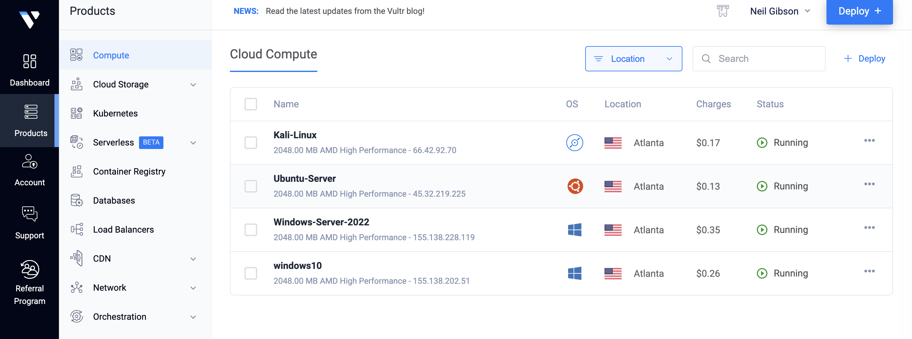
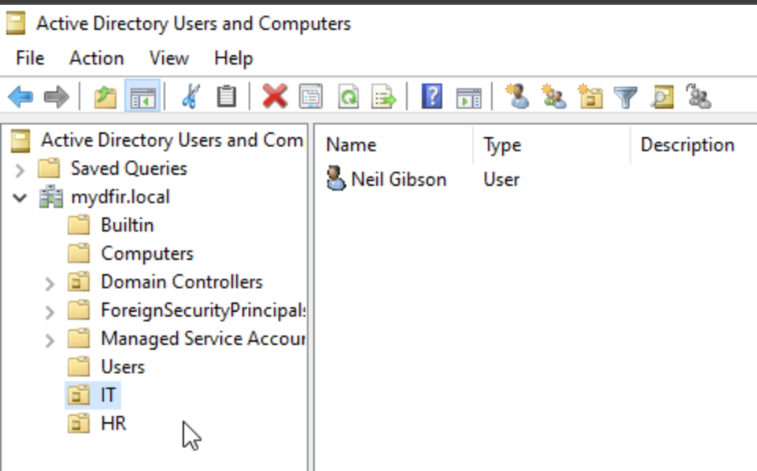
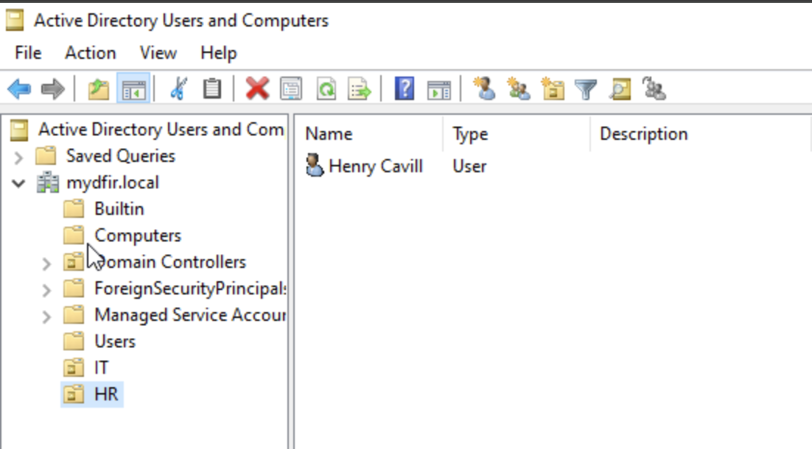
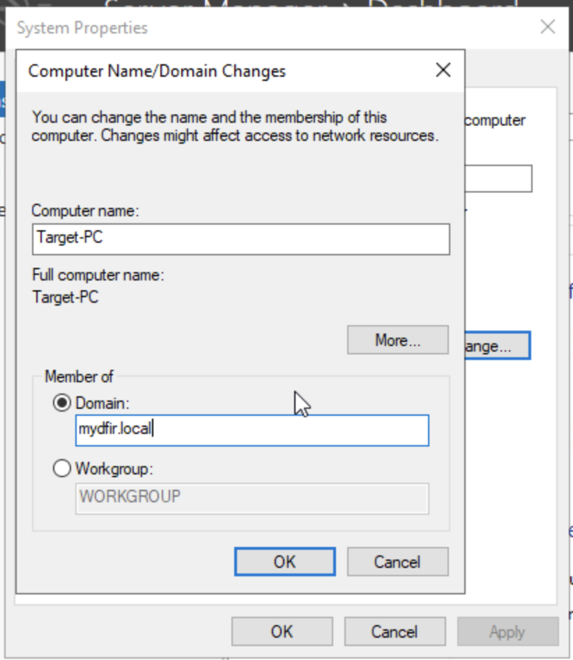
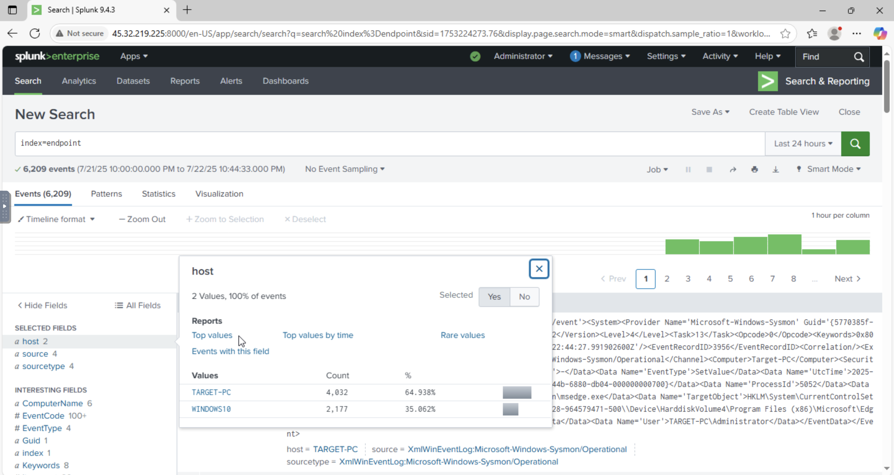
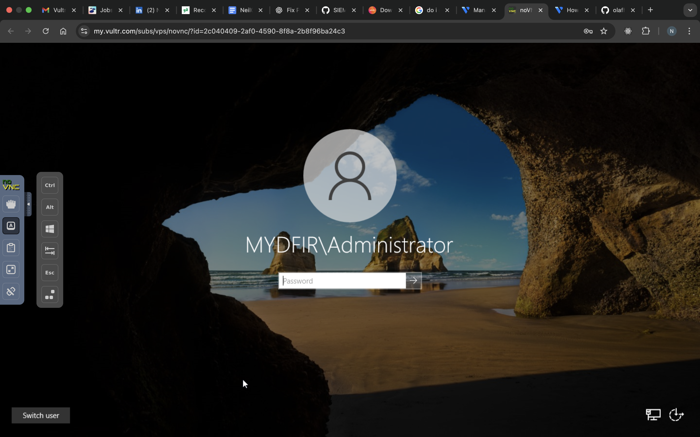

# 🖥️ SIEM & Active Directory Lab

This project documents the setup and configuration of a virtual cybersecurity lab hosted on **Vultr**, featuring:

- A **Windows Server Domain Controller** with Active Directory (`mydfir.local`)
- A **Windows 10 client** joined to the domain
- A **Splunk server** running on Ubuntu for centralized log collection and analysis

## 🔧 Lab Setup

### 🧱 Virtual Machines (Hosted on Vultr)

| Role                     | OS                | IP Address         |
|--------------------------|-------------------|---------------------|
| Splunk Server            | Ubuntu 22.04      | `45.32.219.225`     |
| Domain Controller (AD)   | Windows Server 2019 | `155.138.228.119` |
| Domain Client            | Windows 10 Pro    | `155.138.202.51`    |

---

### 🛠 Tools Used
- Splunk Enterprise (Free license for testing)
- Splunk Universal Forwarder
- Sysmon (with [Sysmon Config](https://github.com/olafhartong/sysmon-modular))
- VirtualBox / VMware (for local replication)
- Active Directory Users & Computers
- Group Policy Management Console (GPMC)
- Windows Event Viewer

## 🗂️ Configuration Summary

- Deployed three virtual machines via Vultr and configured networking to enable secure communication.
- Created the domain `mydfir.local` on the Windows Server and successfully joined the client machine.
- Installed and configured **Sysmon** for enhanced security logging on both Windows systems.
- Deployed **Splunk Universal Forwarder** to forward event logs (Security, Sysmon, etc.) to the Splunk server.
- Ingested and analyzed logs within Splunk dashboards, including failed logons, group membership changes, and process execution events.

## 🧰 Step-by-Step Lab Setup

### 🔹 1. Create Virtual Machines on Vultr

Provision three virtual machines from the Vultr dashboard and configure static IPs or track public IPs for Splunk and Windows communication

  
*Figure 1: Virtual machines deployed on Vultr for the lab setup.*

---

### 🔹 2. Install and Configure Splunk (Ubuntu 22.04)

Install Splunk and access it via the web interface at `http://45.32.219.225:8000`.
Sign in using the credentials you gave during the setup

---

### 🔹 3. Allow Required Ports on Ubuntu Firewall (UFW)

Enable UFW and allow ports `8000` and `9997` for Splunk on your Ubuntu server

sudo ufw allow 8000/tcp    # Splunk Web UI
sudo ufw allow 9997/tcp    # Splunk Forwarder receiving port
sudo ufw status

---

### 🔹 4. Set Up Active Directory Domain Controller (`mydfir.local`)

1. On the Windows Server, install **Active Directory Domain Services (AD DS)** via Server Manager.

2. Promote the server to a domain controller and create a new forest named `mydfir.local`.

3. Reboot the machine and log in with domain admin credentials.

4. Open **Active Directory Users and Computers** to create domain users and organizational units (OUs).
  
*Figure 2: IT Organizational Unit created in Active Directory.*

  
*Figure 3: HR Organizational Unit created in Active Directory.*

---


### 🔹 5. Join Windows 10 Client to the Domain

On the Windows 10 client:

1. Go to **System Properties** → **Change Settings** → **Join a domain**.

2. Enter the domain name: `mydfir.local`.

3. Authenticate using a domain account.

4. Reboot the machine and log in with the domain account.

  
*Figure 4: Windows 10 client successfully joined to the domain.*

---

### 🔹 6. Install and Configure Sysmon on Windows Hosts

1. Download **Sysmon** from [Microsoft Sysinternals](https://learn.microsoft.com/en-us/sysinternals/downloads/sysmon).

2. Download a recommended configuration file from [Sysmon Config](https://github.com/olafhartong/sysmon-modular).

3. Install Sysmon and apply the configuration by running the following command in PowerShell (Ensure you have the right path to sysmonconfig.xml):

   ```powershell
   sysmon.exe -accepteula -i sysmonconfig.xml
  
---

### 🔹 7. Install Splunk Universal Forwarder on Windows

1. Download the installer from [Splunk Universal Forwarder Downloads](https://www.splunk.com/en_us/download/universal-forwarder.html).

2. During installation:
   - Set Splunk server IP to `45.32.219.225`.
   - Set Forwarder port to `9997`.
   - Select event log sources to forward.

3. Start the forwarder service by running this command in PowerShell:

   ```powershell
   net start splunkforwarder

---

### 🔹 8. Configure Splunk Inputs (`inputs.conf`)

On the Splunk server, configure inputs to receive logs from the forwarders.


Create file at **File path:** `/opt/splunk/etc/system/local/inputs.conf`

```ini
[WinEventLog://Application]
index = endpoint
disabled = false

[WinEventLog://Security]
index = endpoint
disabled = false

[WinEventLog://System]
index = endpoint
disabled = false

[WinEventLog://Microsoft-Windows-Sysmon/Operational]
index = endpoint
disabled = false
renderXml = true
source = XmlWinEventLog:Microsoft-Windows-Sysmon/Operational
```

  
*Figure 5: Splunk server recieving logs forwarded from windows hosts.*

---

### 🔹 9. Verify Log Ingestion and Build Dashboards

1. Use the Splunk search bar to confirm event ingestion by running the following query:
  ```splunk
   index=endpoint
  ```
2. Build dashboards to monitor key security events, such as:

   - User logons (event IDs 4624, 4625)
   - Sysmon events (process creation, network activity)
   - Group Policy Object (GPO) changes and group membership modifications

---

### 🔹 10. Confirm Active Directory success by signing into the domain

Reboot your windows machine to sign into the newly created domain.

  
*Figure 6: Signing into mydfir.local.*

---

### 🔍 Key Learnings

- Deployed a working Active Directory environment in the cloud with `mydfir.local`.
- Used Sysmon for deep telemetry and Universal Forwarder for reliable log transport.
- Configured Splunk to act as a basic SIEM with centralized log collection.
- Built a platform suitable for testing detections, alerting, and analysis.
